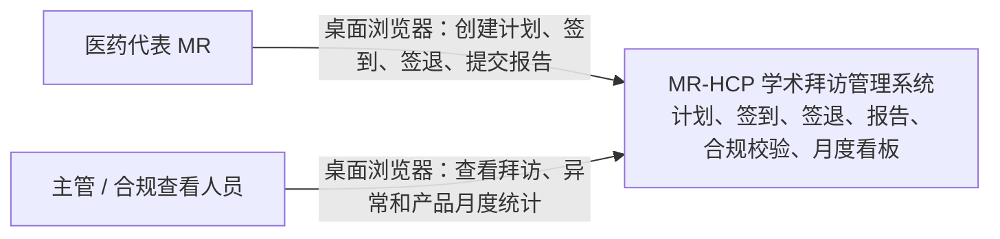
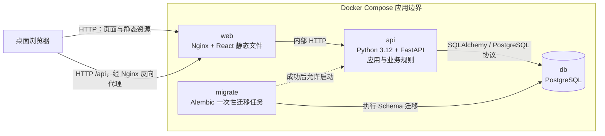

# 医药代表学术拜访管理子系统：系统架构

## 1. 架构目标与原则

本文档基于 [业务规则](business-rules.md) 设计 MVP 架构。目标是在笔试周期内交付一个结构清晰、可测试、可演示，并可通过 Docker Compose 一键运行的桌面 Web 应用。

架构原则如下：

- 采用一个 React 单页应用、一个 FastAPI 模块化单体和一个 PostgreSQL 数据库。
- 不拆分微服务，不引入 CQRS、消息队列、事件溯源或分布式事务。
- HTTP 路由不直接承载核心业务规则，只负责协议适配和调用应用用例。
- 前端提供输入和展示，不生成可信业务时间，不计算最终距离、时长、状态或合规结论。
- 合规算法保持纯函数化，不依赖 FastAPI、SQLAlchemy、Pydantic 或数据库连接。
- PostgreSQL 负责数据完整性、并发一致性和集合聚合；应用层负责业务语义和流程编排。
- 以可读性和明确依赖方向为主，不为 MVP 引入复杂的通用框架或抽象层。

## 2. 系统上下文图



说明：MVP 没有外部身份提供方、地图 SDK、文件存储或第三方 CRM。MR 和查看人员是业务角色，不代表已经实现登录或权限隔离。

## 3. 容器级架构图



部署约定：

- `web` 是浏览器访问的统一入口，并把 `/api` 请求转发给 `api`。
- `api` 不保存本地业务状态，可随容器重建；可信业务数据只写入 PostgreSQL。
- `migrate` 与 `api` 使用同一个后端镜像，但执行不同命令。迁移成功后才启动 API。
- `db` 使用命名卷持久化数据并配置健康检查。
- 容器内部时间环境统一使用 UTC；业务时区通过配置传给 API 和前端。

## 4. 后端分层与目录结构

### 4.1 分层职责

| 层 | 主要职责 | 不应承担的职责 |
| --- | --- | --- |
| API 层 | 路由、请求解析、Pydantic 校验、依赖注入、HTTP 状态码和错误响应 | 状态机判断、合规计算、直接编写事务流程 |
| 应用层 | 编排创建计划、签到、签退、提交报告和查询看板用例；定义事务边界 | HTTP 细节、距离公式、ORM 表结构定义 |
| 领域层 | 状态与异常枚举、业务错误、状态转换规则、Haversine 距离和合规判断 | 数据库查询、提交事务、读取环境变量 |
| 持久化层 | SQLAlchemy 模型、Session、仓储操作、锁、统计 SQL 和 Alembic 迁移 | 决定 HTTP 响应、在触发器中隐藏核心业务流程 |
| 核心支撑 | 配置、UTC 时钟抽象、日志等跨层基础能力 | 具体拜访用例逻辑 |

依赖方向应保持为：API 调用应用层，应用层调用领域规则和持久化能力，持久化层不反向调用 API。领域层不依赖其他业务层。

### 4.2 建议目录

```text
backend/
├── alembic.ini
├── alembic/
│   ├── env.py
│   └── versions/
├── pyproject.toml
├── Dockerfile
├── app/
│   ├── main.py
│   ├── core/
│   │   ├── config.py
│   │   ├── clock.py
│   │   └── logging.py
│   ├── api/
│   │   ├── dependencies.py
│   │   ├── error_handlers.py
│   │   ├── router.py
│   │   └── routes/
│   │       ├── dashboard.py
│   │       ├── reference_data.py
│   │       └── visits.py
│   ├── schemas/
│   │   ├── common.py
│   │   ├── dashboard.py
│   │   ├── reference_data.py
│   │   └── visit.py
│   ├── application/
│   │   └── services/
│   │       ├── dashboard_service.py
│   │       └── visit_service.py
│   ├── domain/
│   │   ├── compliance.py
│   │   ├── enums.py
│   │   ├── errors.py
│   │   └── state_machine.py
│   └── db/
│       ├── base.py
│       ├── session.py
│       ├── models/
│       │   ├── reference_data.py
│       │   └── visit.py
│       ├── repositories/
│       │   ├── reference_data.py
│       │   └── visits.py
│       └── queries/
│           └── monthly_product_stats.py
└── tests/
    ├── unit/
    │   ├── test_compliance.py
    │   ├── test_state_machine.py
    │   └── test_time_boundaries.py
    ├── integration/
    │   ├── test_monthly_product_stats.py
    │   └── test_visit_transactions.py
    └── api/
        ├── test_dashboard_api.py
        └── test_visits_api.py
```

这是务实分层，而不是完整的六边形架构：MVP 不为每个仓储创建形式化接口和独立领域实体映射。应用服务可以通过清晰的仓储函数使用 SQLAlchemy Session，但领域算法必须保持无 ORM 依赖。

## 5. 前端目录结构

```text
frontend/
├── Dockerfile
├── index.html
├── nginx.conf
├── package.json
├── tsconfig.json
├── vite.config.ts
└── src/
    ├── main.tsx
    ├── App.tsx
    ├── api/
    │   ├── client.ts
    │   ├── dashboard.ts
    │   ├── referenceData.ts
    │   └── visits.ts
    ├── app/
    │   ├── routes.tsx
    │   └── theme.ts
    ├── components/
    │   ├── AppLayout.tsx
    │   ├── ErrorAlert.tsx
    │   └── StatusTag.tsx
    ├── config/
    │   └── runtime.ts
    ├── features/
    │   ├── dashboard/
    │   │   ├── DashboardPage.tsx
    │   │   ├── ProductVisitChart.tsx
    │   │   └── types.ts
    │   ├── reference-data/
    │   │   └── hooks.ts
    │   └── visits/
    │       ├── VisitCreatePage.tsx
    │       ├── VisitDetailPage.tsx
    │       ├── VisitListPage.tsx
    │       ├── components/
    │       │   ├── CheckInForm.tsx
    │       │   ├── CheckOutForm.tsx
    │       │   └── CallReportForm.tsx
    │       └── types.ts
    ├── utils/
    │   └── dateTime.ts
    └── test/
        └── setup.ts
```

前端约定：

- 按业务功能组织页面和组件，通用组件才进入 `components/`。
- `api/` 只负责 HTTP 调用和响应类型，不复制后端状态机或合规公式。
- 前端可根据服务端状态控制按钮展示，但后端仍必须重新校验所有状态转换。
- `dateTime.ts` 只负责把 API 返回的带时区时间转换为配置的业务时区并格式化，不改变统计归属。
- 停留时长、距离、异常原因和状态以 API 返回值为准；前端最多做展示格式化。
- MVP 使用页面局部状态和小型复用 Hook 即可，不强制引入全局状态管理库。

## 6. API 与数据库的职责划分

| 关注点 | API / 应用服务职责 | PostgreSQL / 持久化职责 |
| --- | --- | --- |
| 输入 | 校验请求结构、经纬度范围、带时区时间和必填字段 | 通过类型、非空约束和检查约束提供最后一道保护 |
| 引用关系 | 返回明确的医院、HCP、科室、产品不存在或不匹配错误 | 外键保证引用记录真实存在 |
| 目标产品 | 校验至少一个产品并拒绝请求内重复项 | 联结表唯一约束保证同一拜访与产品组合唯一 |
| 状态机 | 判断当前状态能否执行签到、签退或提交报告 | 在事务中锁定目标行，原子保存状态和业务数据 |
| 服务端时间 | 通过可注入 UTC Clock 生成签到、签退和记录时间 | 使用带时区时间列持久化；数据库默认值可保护普通审计字段 |
| 合规计算 | 调用纯领域算法，生成距离、时长和异常原因 | 原子保存计算结果，通过唯一约束防止同类异常重复 |
| 重复操作 | 转换为稳定业务错误和合适的 HTTP 响应 | 行锁和约束防止并发请求同时成功 |
| 月度统计 | 计算业务时区月份对应的 UTC 半开区间，解释统计结果 | 使用 SQL JOIN、筛选、`COUNT DISTINCT` 或 `EXISTS` 完成分组聚合 |
| 输出 | 使用 Pydantic 序列化，返回带时区时间和结构化错误 | 不直接决定 HTTP 字段和错误文案 |

核心业务逻辑不放入数据库触发器或存储过程。数据库约束用于防止非法数据落库，但不会替代应用层的可读业务错误和领域规则测试。

## 7. 事务边界

每个写用例使用一个短事务。事务由应用服务开启和结束，API 路由不手工提交多次。

### 7.1 创建计划

一个事务内完成：

1. 验证 MR、医院、科室、HCP 和目标产品引用；
2. 验证 HCP、科室和医院之间的有效关系；
3. 创建 `PLANNED` 拜访；
4. 批量创建拜访与目标产品关联。

任何一步失败都整体回滚，不能留下没有产品的拜访。

### 7.2 签到

一个事务内完成：

1. 使用 `SELECT ... FOR UPDATE` 锁定拜访行；
2. 验证状态必须为 `PLANNED`；
3. 从服务端 Clock 获取 UTC 签到时间；
4. 调用纯领域算法计算签到距离和已知异常；
5. 保存签到事实、异常原因并更新为 `CHECKED_IN`；
6. 提交事务。

并发或重复签到在获得锁后会看到状态已改变，因此只能有一个请求成功。

### 7.3 签退

一个事务内完成：

1. 锁定拜访行；
2. 验证状态必须为 `CHECKED_IN`；
3. 从服务端 Clock 获取 UTC 签退时间；
4. 计算停留时长和签退距离；
5. 生成并合并全部异常原因，不能覆盖签到时已经产生的异常；
6. 保存签退事实并更新为 `CHECKED_OUT`；
7. 提交事务。

### 7.4 首次提交拜访记录

一个事务内完成：

1. 锁定拜访行；
2. 验证状态必须为 `CHECKED_OUT`；
3. 创建完整拜访记录；
4. 更新状态为 `REPORTED`；
5. 提交事务。

报告和状态必须同时成功或同时回滚，不能出现已有报告但状态仍为 `CHECKED_OUT` 的情况。

### 7.5 查询事务

- 列表、详情、基础数据和看板使用只读查询，不持有跨请求事务。
- 月度看板由单条或同一短事务内的少量聚合 SQL 返回，PostgreSQL 默认 `READ COMMITTED` 对 MVP 足够。
- 不在数据库事务中调用外部网络服务；本 MVP 也没有此类依赖。

## 8. 合规算法所在层

合规算法放在 `backend/app/domain/compliance.py`，属于领域层。

领域算法应具备以下性质：

- 输入是普通值对象或 Python 标准类型，例如医院坐标、签到坐标、签退坐标、签到时间和签退时间。
- 输出是距离、停留秒数和结构化异常代码集合。
- 不读取数据库、不提交事务、不访问 HTTP 请求，也不直接读取环境变量。
- 不依赖 FastAPI、Pydantic 或 SQLAlchemy，因此可以在毫秒级单元测试中覆盖 300 秒和 500 米边界。
- 固定业务阈值在领域模块中命名定义，避免散落在路由、服务和前端。

应用服务负责从数据库取得事实、从 Clock 取得服务端时间、调用算法并持久化结果。算法只负责判定，不负责流程编排。

推荐拆分为小型纯函数：

- Haversine 距离计算；
- 签到地点规则判断；
- 签退地点规则判断；
- 停留时长计算与规则判断；
- 合并且去重异常代码。

## 9. 月度统计所在层

月度统计由应用层和持久化查询层协作完成：

1. `dashboard_service.py` 接收月份和业务时区，生成该自然月对应的 UTC 半开区间；
2. `monthly_product_stats.py` 使用一条数据库聚合查询完成产品分组统计；
3. API 层只校验查询参数并序列化统计结果；
4. 前端只展示返回的总次数和异常次数，不对原始拜访列表重新计数。

统计 SQL 必须注意：

- 以 `checked_in_at >= start_utc AND checked_in_at < end_utc` 筛选；
- 只统计已经签到的拜访；
- 通过拜访产品联结表按产品分组；
- 使用唯一关联、`COUNT(DISTINCT visit_id)` 或等价方式避免重复计数；
- 判断异常时使用 `EXISTS` 或去重聚合，避免多个异常原因把同一产品下的同一拜访重复计算；
- 一次多产品拜访应在每个产品下各计一次，因此不能先把整个结果压缩为唯一拜访总数。

把集合聚合放在 PostgreSQL 中可以避免加载全部拜访到 Python，也能让统计口径通过集成测试直接验证。

## 10. 测试分层

| 测试层 | 运行依赖 | 重点范围 | 代表性用例 |
| --- | --- | --- | --- |
| 领域单元测试 | 仅 Python | 合规算法、状态转换、UTC 月份边界函数 | 299.999 秒异常、300 秒正常、500 米正常、超过 500 米异常、多异常并存 |
| 应用服务单元测试 | Python + 测试替身 | 用例编排、Clock 注入、错误转换 | 服务端时间被使用、非法状态不写入、算法结果被完整保存 |
| PostgreSQL 集成测试 | 测试 PostgreSQL | ORM 映射、约束、事务、锁和统计 SQL | 产品唯一约束、报告与状态原子提交、异常去重、跨月及时区统计 |
| API 测试 | FastAPI TestClient + 测试数据库 | 请求响应契约和 HTTP 错误 | 创建计划、完整生命周期、重复签到/签退返回 409、422 参数错误 |
| 前端组件测试 | Vitest + Testing Library | 状态驱动 UI、表单和错误展示 | 仅合法按钮可用、异常原因展示、多产品图表映射 |
| 容器烟雾测试 | Docker Compose | 构建、迁移、健康检查和服务连通 | 一键启动后页面、健康接口和数据库均可访问 |

测试策略：

- 合规算法的大部分边界组合放在快速单元测试中，不依赖数据库。
- 涉及 PostgreSQL 锁、时区、唯一约束和聚合 SQL 的测试使用真实 PostgreSQL，不用 SQLite 替代。
- API 测试验证状态码和响应结构，但不重复穷举所有数学边界。
- 前端不重复测试后端业务算法，只验证交互和展示。
- 可以补充一条最小端到端人工或自动化烟雾路径，但不要求建立大型 E2E 测试套件。

## 11. Docker Compose 服务组成

| 服务 | 镜像来源 | 职责 | 依赖与健康条件 |
| --- | --- | --- | --- |
| `db` | 固定版本 PostgreSQL 官方镜像 | 持久化业务数据 | 使用命名卷；通过 `pg_isready` 健康检查 |
| `migrate` | 项目后端镜像 | 执行 `alembic upgrade head` 后退出 | 等待 `db` 健康；退出码必须为 0 |
| `api` | 项目后端镜像 | 运行 FastAPI/Uvicorn，提供 API 和健康接口 | 等待 `migrate` 成功；自身提供 HTTP 健康检查 |
| `web` | 多阶段构建的 Nginx + React 镜像 | 提供静态页面并反向代理 `/api` | 等待 `api` 健康；暴露唯一用户访问端口 |

Compose 运行约定：

- `docker compose up --build` 完成镜像构建、数据库启动、迁移、API 启动和前端启动。
- 数据库连接、数据库密码和业务时区通过环境变量注入，并提供不含真实秘密的 `.env.example`。
- 使用命名卷保存 PostgreSQL 数据；删除容器不应自动删除业务数据。
- `web` 是默认对外入口，`db` 不暴露到宿主机公网。
- 开发环境如需直接查看 FastAPI 文档，可以显式映射 API 端口或通过 Nginx 转发文档路径；生产式默认路径不要求开放数据库端口。
- Compose 只解决单机演示和评审运行，不宣称具备生产级高可用、备份或水平扩展能力。

## 12. 关键架构决策摘要

| 决策 | 选择 | 原因 |
| --- | --- | --- |
| 部署形态 | React + FastAPI 模块化单体 + PostgreSQL | 满足题目范围，部署和调试成本低 |
| 核心规则位置 | 独立领域模块 | 避免 Controller 膨胀，支持脱离数据库测试 |
| 写入一致性 | 应用服务短事务 + PostgreSQL 行锁 | 防止重复签到、签退和报告并发覆盖 |
| 统计实现 | 应用层确定时间区间，数据库完成聚合 | 保持业务口径清晰并利用数据库集合计算能力 |
| 时间来源 | 可注入的服务端 UTC Clock | 满足可信时间要求，同时便于边界测试 |
| 前端职责 | 输入、流程引导和结果展示 | 不让浏览器成为可信计算来源 |
| 数据库迁移 | 独立一次性 Compose 服务 | 保证一键启动时迁移先于 API，失败可见且不会静默运行旧 Schema |
