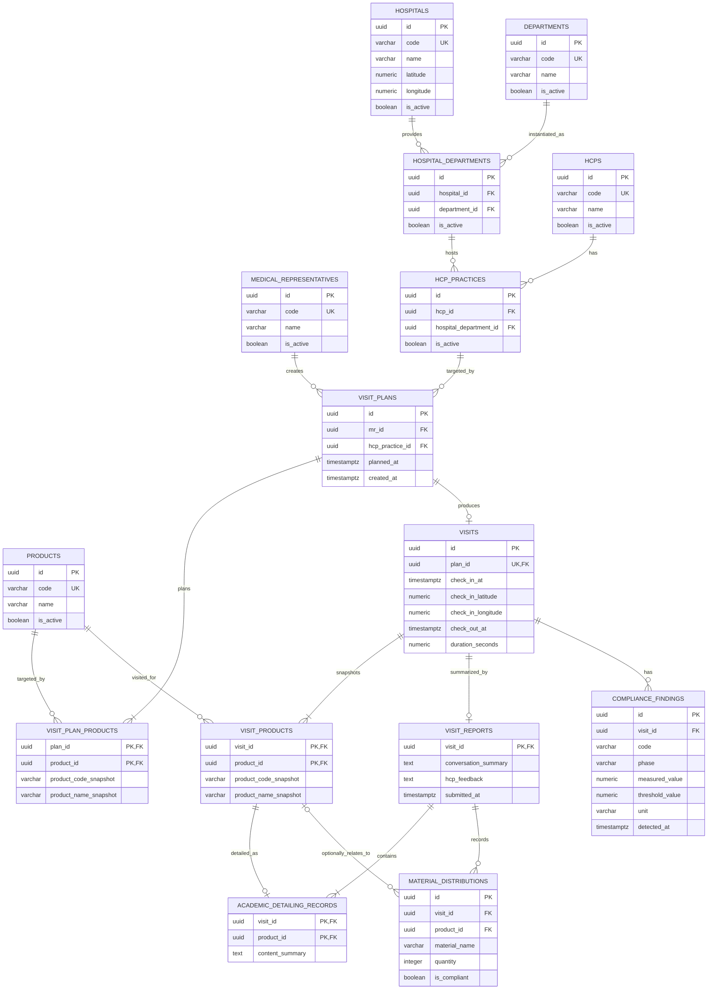

# 医药代表学术拜访管理子系统：PostgreSQL Schema 设计

## 1. 设计目标

本文档基于 [业务规则](business-rules.md) 和 [系统架构](architecture.md)，定义本项目 MVP 的 PostgreSQL Schema。本文只描述数据库设计，不生成 ORM 或迁移代码。

设计原则：

- 使用关系约束保证主键、外键、唯一性、数值范围和字段组合完整性。
- 使用 Service 层保证数据库声明式约束无法完整表达的状态机和跨表业务规则。
- 计划和实际拜访分别建模，一个计划最多产生一次实际拜访。
- 计划产品和实际拜访产品分别保存；首次签到时生成不可变的实际产品快照。
- 现场时间、坐标、距离和合规结论由后端生成或计算，客户端不能提交派生字段。
- 保存可复核的原始数据、计算结果、阈值和主数据快照。
- 不使用级联删除历史，不使用通用软删除，不用触发器承载核心流程。

## 2. Mermaid ER 图



ER 图中的“至少一个计划产品”“签到时至少一个实际产品”和“报告至少一条学术沟通记录”是跨行规则，由 Service 层事务保证。数据库使用复合主键保证集合内部不重复。

## 3. 核心建模决策

### 3.1 医生、医院和科室

使用两级关联避免三个独立外键互相矛盾：

1. `hospital_departments` 表示某医院开设某标准科室；
2. `hcp_practices` 表示某医生在某医院科室执业；
3. `visit_plans.hcp_practice_id` 引用一条执业关系，由此唯一确定医生、医院和科室。

### 3.2 计划和实际拜访

- `visit_plans` 保存计划目标和创建时的主数据展示快照。
- `visits` 保存签到、签退及其计算结果。
- `visits.plan_id` 是非空唯一外键，形成 `visit_plans 1 : 0..1 visits`。
- 首次签到事务锁定计划行、创建 `visits`、复制实际产品集合并保存签到异常。

### 3.3 状态机不保存冗余状态字段

数据库不保存独立 `status` 列。当前状态从事实派生：

| 派生状态 | 数据事实 |
| --- | --- |
| `PLANNED` | 计划存在，`visits` 不存在 |
| `CHECKED_IN` | `visits` 存在且 `check_out_at IS NULL` |
| `CHECKED_OUT` | `check_out_at IS NOT NULL` 且 `visit_reports` 不存在 |
| `REPORTED` | `visit_reports` 存在 |

这消除了状态列与子表事实不同步的问题。但普通外键和 CHECK 无法保证“报告一定在签退后创建”等跨表时序，因此合法状态转换仍必须由 Service 层在事务中校验。

### 3.4 计划产品和实际产品

- `visit_plan_products` 保存创建计划时的目标产品，至少一条。
- 首次签到时，Service 层在同一事务中把目标产品复制到 `visit_products`。
- `visit_products` 是实际拜访的不可变产品快照，也是月度看板的统计来源。
- 两张表均使用复合主键防止同一产品重复。
- 签到后即使未来支持修改计划产品，也不会改变历史实际拜访统计。

### 3.5 历史可追溯性

- 计划保存 MR、医生、医院、科室的代码和名称快照。
- 计划产品和实际产品保存产品代码、名称快照。
- 实际拜访保存签到时使用的医院坐标快照；签到和签退使用同一快照计算距离。
- 合规异常保存结构化代码、阶段、测量值、规则阈值、单位和发现时间。
- 签到事实创建后不可修改；`visits` 只允许一次受条件保护的签退填充。实际产品、报告和异常创建后不提供修改或删除操作。
- 主数据使用 `is_active` 停用，外键使用 `ON DELETE RESTRICT`，历史不会因主数据删除而级联丢失。

## 4. 通用字段约定

- 主键使用应用生成的 `UUID`。
- 所有业务时间和审计时间使用 `TIMESTAMPTZ`。
- 数据库连接会话使用 UTC；前端按配置的 IANA 业务时区显示。
- `created_at` 默认 `CURRENT_TIMESTAMP`。
- 经纬度使用 `NUMERIC(9,6)`。
- 距离使用 `NUMERIC(15,6)` 米。
- 停留时长使用 `NUMERIC(18,6)` 秒。
- 代码和名称字段必须满足 `btrim(value) <> ''`。

## 5. 表职责与字段设计

### 5.1 `medical_representatives`

职责：保存医药代表主数据。

| 字段 | 类型 | 可空 | 说明 |
| --- | --- | --- | --- |
| `id` | `UUID` | 否 | 主键 |
| `code` | `VARCHAR(50)` | 否 | 业务唯一代码 |
| `name` | `VARCHAR(100)` | 否 | 姓名 |
| `is_active` | `BOOLEAN` | 否 | 默认 `TRUE` |
| `created_at` | `TIMESTAMPTZ` | 否 | 默认 `CURRENT_TIMESTAMP` |
| `updated_at` | `TIMESTAMPTZ` | 否 | 默认 `CURRENT_TIMESTAMP` |

约束和索引：

- `PRIMARY KEY (id)`；`UNIQUE (code)`。
- `CHECK (btrim(code) <> '')`；`CHECK (btrim(name) <> '')`。
- `idx_medical_representatives_active_name (is_active, name)`。

### 5.2 `hospitals`

职责：保存医院及用于距离计算的当前标准坐标。

| 字段 | 类型 | 可空 | 说明 |
| --- | --- | --- | --- |
| `id` | `UUID` | 否 | 主键 |
| `code` | `VARCHAR(50)` | 否 | 业务唯一代码 |
| `name` | `VARCHAR(200)` | 否 | 医院名称 |
| `address` | `VARCHAR(500)` | 是 | 展示地址 |
| `latitude` | `NUMERIC(9,6)` | 否 | WGS 84 纬度 |
| `longitude` | `NUMERIC(9,6)` | 否 | WGS 84 经度 |
| `is_active` | `BOOLEAN` | 否 | 默认 `TRUE` |
| `created_at` | `TIMESTAMPTZ` | 否 | 默认 `CURRENT_TIMESTAMP` |
| `updated_at` | `TIMESTAMPTZ` | 否 | 默认 `CURRENT_TIMESTAMP` |

约束和索引：

- `PRIMARY KEY (id)`；`UNIQUE (code)`。
- `CHECK (latitude BETWEEN -90 AND 90)`。
- `CHECK (longitude BETWEEN -180 AND 180)`。
- 代码、名称非空白 CHECK。
- `idx_hospitals_active_name (is_active, name)`。

### 5.3 `departments`

职责：保存标准科室字典。

| 字段 | 类型 | 可空 | 说明 |
| --- | --- | --- | --- |
| `id` | `UUID` | 否 | 主键 |
| `code` | `VARCHAR(50)` | 否 | 业务唯一代码 |
| `name` | `VARCHAR(100)` | 否 | 标准科室名称 |
| `is_active` | `BOOLEAN` | 否 | 默认 `TRUE` |
| `created_at` | `TIMESTAMPTZ` | 否 | 默认 `CURRENT_TIMESTAMP` |
| `updated_at` | `TIMESTAMPTZ` | 否 | 默认 `CURRENT_TIMESTAMP` |

约束和索引：

- `PRIMARY KEY (id)`；`UNIQUE (code)`。
- 代码、名称非空白 CHECK。
- `idx_departments_active_name (is_active, name)`。

### 5.4 `hospital_departments`

职责：表示医院实际开设的标准科室。

| 字段 | 类型 | 可空 | 说明 |
| --- | --- | --- | --- |
| `id` | `UUID` | 否 | 主键 |
| `hospital_id` | `UUID` | 否 | 外键到 `hospitals.id` |
| `department_id` | `UUID` | 否 | 外键到 `departments.id` |
| `display_name` | `VARCHAR(100)` | 是 | 医院内部名称 |
| `is_active` | `BOOLEAN` | 否 | 默认 `TRUE` |
| `created_at` | `TIMESTAMPTZ` | 否 | 默认 `CURRENT_TIMESTAMP` |
| `updated_at` | `TIMESTAMPTZ` | 否 | 默认 `CURRENT_TIMESTAMP` |

约束和索引：

- `PRIMARY KEY (id)`。
- 两个外键均使用 `ON DELETE RESTRICT`。
- `UNIQUE (hospital_id, department_id)`。
- `CHECK (display_name IS NULL OR btrim(display_name) <> '')`。
- `idx_hospital_departments_department_id (department_id)`。

### 5.5 `hcps`

职责：保存医生主数据。

| 字段 | 类型 | 可空 | 说明 |
| --- | --- | --- | --- |
| `id` | `UUID` | 否 | 主键 |
| `code` | `VARCHAR(50)` | 否 | 业务唯一代码 |
| `name` | `VARCHAR(100)` | 否 | 姓名 |
| `professional_title` | `VARCHAR(100)` | 是 | 职称 |
| `is_active` | `BOOLEAN` | 否 | 默认 `TRUE` |
| `created_at` | `TIMESTAMPTZ` | 否 | 默认 `CURRENT_TIMESTAMP` |
| `updated_at` | `TIMESTAMPTZ` | 否 | 默认 `CURRENT_TIMESTAMP` |

约束和索引：

- `PRIMARY KEY (id)`；`UNIQUE (code)`。
- 代码、名称非空白 CHECK。
- `CHECK (professional_title IS NULL OR btrim(professional_title) <> '')`。
- `idx_hcps_active_name (is_active, name)`。

### 5.6 `hcp_practices`

职责：表示医生在某医院科室的执业关系。

| 字段 | 类型 | 可空 | 说明 |
| --- | --- | --- | --- |
| `id` | `UUID` | 否 | 主键 |
| `hcp_id` | `UUID` | 否 | 外键到 `hcps.id` |
| `hospital_department_id` | `UUID` | 否 | 外键到 `hospital_departments.id` |
| `is_active` | `BOOLEAN` | 否 | 默认 `TRUE` |
| `created_at` | `TIMESTAMPTZ` | 否 | 默认 `CURRENT_TIMESTAMP` |
| `updated_at` | `TIMESTAMPTZ` | 否 | 默认 `CURRENT_TIMESTAMP` |

约束和索引：

- `PRIMARY KEY (id)`。
- 两个外键均使用 `ON DELETE RESTRICT`。
- `UNIQUE (hcp_id, hospital_department_id)`。
- `idx_hcp_practices_hospital_department_id (hospital_department_id)`。

### 5.7 `products`

职责：保存产品主数据。

| 字段 | 类型 | 可空 | 说明 |
| --- | --- | --- | --- |
| `id` | `UUID` | 否 | 主键 |
| `code` | `VARCHAR(50)` | 否 | 业务唯一代码 |
| `name` | `VARCHAR(200)` | 否 | 产品名称 |
| `is_active` | `BOOLEAN` | 否 | 默认 `TRUE` |
| `created_at` | `TIMESTAMPTZ` | 否 | 默认 `CURRENT_TIMESTAMP` |
| `updated_at` | `TIMESTAMPTZ` | 否 | 默认 `CURRENT_TIMESTAMP` |

约束和索引：

- `PRIMARY KEY (id)`；`UNIQUE (code)`。
- 代码、名称非空白 CHECK。
- `idx_products_active_name (is_active, name)`。

### 5.8 `visit_plans`

职责：保存计划目标及创建时的主数据展示快照。计划本身不保存冗余状态。

| 字段 | 类型 | 可空 | 说明 |
| --- | --- | --- | --- |
| `id` | `UUID` | 否 | 主键 |
| `mr_id` | `UUID` | 否 | 外键到 `medical_representatives.id` |
| `hcp_practice_id` | `UUID` | 否 | 外键到 `hcp_practices.id` |
| `planned_at` | `TIMESTAMPTZ` | 否 | 带时区输入转换成 UTC 后保存 |
| `mr_code_snapshot` | `VARCHAR(50)` | 否 | MR 代码快照 |
| `mr_name_snapshot` | `VARCHAR(100)` | 否 | MR 姓名快照 |
| `hcp_code_snapshot` | `VARCHAR(50)` | 否 | HCP 代码快照 |
| `hcp_name_snapshot` | `VARCHAR(100)` | 否 | HCP 姓名快照 |
| `hospital_code_snapshot` | `VARCHAR(50)` | 否 | 医院代码快照 |
| `hospital_name_snapshot` | `VARCHAR(200)` | 否 | 医院名称快照 |
| `department_code_snapshot` | `VARCHAR(50)` | 否 | 科室代码快照 |
| `department_name_snapshot` | `VARCHAR(100)` | 否 | 科室名称快照 |
| `created_at` | `TIMESTAMPTZ` | 否 | 默认 `CURRENT_TIMESTAMP` |

约束和索引：

- `PRIMARY KEY (id)`。
- 两个外键均使用 `ON DELETE RESTRICT`。
- 所有快照代码和名称均设置非空白 CHECK。
- `idx_visit_plans_mr_planned_at (mr_id, planned_at DESC)`。
- `idx_visit_plans_hcp_practice_id (hcp_practice_id)`。

计划创建后在 MVP 中不可修改。主数据快照用于历史展示，外键用于当前关系查询和完整性校验。

### 5.9 `visit_plan_products`

职责：保存计划创建时至少一个目标产品。

| 字段 | 类型 | 可空 | 说明 |
| --- | --- | --- | --- |
| `plan_id` | `UUID` | 否 | 外键到 `visit_plans.id`，复合主键第一列 |
| `product_id` | `UUID` | 否 | 外键到 `products.id`，复合主键第二列 |
| `product_code_snapshot` | `VARCHAR(50)` | 否 | 产品代码快照 |
| `product_name_snapshot` | `VARCHAR(200)` | 否 | 产品名称快照 |
| `created_at` | `TIMESTAMPTZ` | 否 | 默认 `CURRENT_TIMESTAMP` |

约束和索引：

- `PRIMARY KEY (plan_id, product_id)`，保证同一计划不重复选择产品。
- 两个外键均使用 `ON DELETE RESTRICT`。
- 产品快照非空白 CHECK。
- `idx_visit_plan_products_product_plan (product_id, plan_id)`。
- 至少一条产品是跨行规则，由创建计划 Service 事务保证。

### 5.10 `visits`

职责：保存实际拜访的签到、签退、医院坐标快照和服务端派生结果。

| 字段 | 类型 | 可空 | 说明 |
| --- | --- | --- | --- |
| `id` | `UUID` | 否 | 主键 |
| `plan_id` | `UUID` | 否 | 唯一外键到 `visit_plans.id` |
| `hospital_latitude_snapshot` | `NUMERIC(9,6)` | 否 | 签到时医院纬度快照 |
| `hospital_longitude_snapshot` | `NUMERIC(9,6)` | 否 | 签到时医院经度快照 |
| `check_in_at` | `TIMESTAMPTZ` | 否 | 服务端 UTC Clock 生成 |
| `check_in_latitude` | `NUMERIC(9,6)` | 否 | 客户端输入的签到纬度 |
| `check_in_longitude` | `NUMERIC(9,6)` | 否 | 客户端输入的签到经度 |
| `check_in_distance_meters` | `NUMERIC(15,6)` | 否 | 后端 Haversine 算法计算 |
| `check_out_at` | `TIMESTAMPTZ` | 是 | 服务端 UTC Clock 生成；签退前为空 |
| `check_out_latitude` | `NUMERIC(9,6)` | 是 | 签退前为空 |
| `check_out_longitude` | `NUMERIC(9,6)` | 是 | 签退前为空 |
| `check_out_distance_meters` | `NUMERIC(15,6)` | 是 | 后端计算；签退前为空 |
| `duration_seconds` | `NUMERIC(18,6)` | 是 | 数据库生成列，客户端和应用均不可写 |
| `created_at` | `TIMESTAMPTZ` | 否 | 默认 `CURRENT_TIMESTAMP` |
| `updated_at` | `TIMESTAMPTZ` | 否 | 默认 `CURRENT_TIMESTAMP`，签退时更新 |

核心约束：

- `PRIMARY KEY (id)`。
- `UNIQUE (plan_id)`，保证一个计划最多一次实际拜访。
- `FOREIGN KEY (plan_id) REFERENCES visit_plans(id) ON DELETE RESTRICT`。
- 三组纬度分别检查 `BETWEEN -90 AND 90`：医院快照、签到、签退。
- 三组经度分别检查 `BETWEEN -180 AND 180`：医院快照、签到、签退。
- `CHECK (check_in_distance_meters >= 0)`。
- `CHECK (check_out_distance_meters IS NULL OR check_out_distance_meters >= 0)`。
- 签退时间、签退坐标和签退距离必须同时为空或同时非空。
- 签退存在时，`CHECK (check_out_at >= check_in_at)`。
- `duration_seconds` 定义为存储生成列：签退为空时为 `NULL`，否则为 `EXTRACT(EPOCH FROM (check_out_at - check_in_at))`。
- `CHECK (duration_seconds IS NULL OR duration_seconds >= 0)`。
- `CHECK (updated_at >= created_at)`。

索引：

- `UNIQUE (plan_id)` 自带唯一索引，用于计划到实际拜访的一对一查询。
- `idx_visits_check_in_at_id (check_in_at, id)`，用于月度范围筛选后连接产品。

API 请求模型不得出现距离、`check_in_at`、`check_out_at` 或 `duration_seconds`。签到和签退 Service 只接收坐标；时间由服务端生成，距离由领域算法生成，时长由数据库生成列生成。

### 5.11 `visit_products`

职责：保存首次签到时复制的实际拜访产品快照，是月度产品统计的唯一产品关系来源。

| 字段 | 类型 | 可空 | 说明 |
| --- | --- | --- | --- |
| `visit_id` | `UUID` | 否 | 外键到 `visits.id`，复合主键第一列 |
| `product_id` | `UUID` | 否 | 外键到 `products.id`，复合主键第二列 |
| `product_code_snapshot` | `VARCHAR(50)` | 否 | 从计划产品复制 |
| `product_name_snapshot` | `VARCHAR(200)` | 否 | 从计划产品复制 |
| `created_at` | `TIMESTAMPTZ` | 否 | 默认 `CURRENT_TIMESTAMP` |

约束和索引：

- `PRIMARY KEY (visit_id, product_id)`，等价于对 `(visit_id, product_id)` 建立唯一约束，保证同一实际拜访中的同一产品最多一次。
- 两个外键均使用 `ON DELETE RESTRICT`。
- 产品快照非空白 CHECK。
- `idx_visit_products_product_visit (product_id, visit_id)`，支持按产品分组和筛选。

该表创建后不可修改或删除。应用运行角色不应获得该表的 UPDATE/DELETE 权限。

### 5.12 `visit_reports`

职责：保存签退后首次提交的完整拜访报告。`visit_id` 同时作为主键和外键，保证一对一。

| 字段 | 类型 | 可空 | 说明 |
| --- | --- | --- | --- |
| `visit_id` | `UUID` | 否 | 主键；外键到 `visits.id` |
| `conversation_summary` | `TEXT` | 否 | 谈话要点 |
| `hcp_feedback` | `TEXT` | 否 | 医生反馈；无反馈时提交明确文本 |
| `submitted_at` | `TIMESTAMPTZ` | 否 | 服务端 UTC Clock 生成 |
| `created_at` | `TIMESTAMPTZ` | 否 | 默认 `CURRENT_TIMESTAMP` |

约束：

- `PRIMARY KEY (visit_id)`。
- `FOREIGN KEY (visit_id) REFERENCES visits(id) ON DELETE RESTRICT`。
- 谈话要点和医生反馈非空白 CHECK。
- 报告提交后在 MVP 中不可修改或删除。

数据库外键不能判断 `visits.check_out_at` 是否非空；只有 `CHECKED_OUT` 才能提交报告的规则由报告 Service 在锁定计划后校验。

### 5.13 `academic_detailing_records`

职责：作为完整报告的子项，按实际拜访产品保存学术沟通内容。

| 字段 | 类型 | 可空 | 说明 |
| --- | --- | --- | --- |
| `visit_id` | `UUID` | 否 | 报告及实际拜访 ID，复合主键第一列 |
| `product_id` | `UUID` | 否 | 实际拜访产品 ID，复合主键第二列 |
| `content_summary` | `TEXT` | 否 | 该产品的学术沟通内容 |
| `created_at` | `TIMESTAMPTZ` | 否 | 默认 `CURRENT_TIMESTAMP` |

约束：

- `PRIMARY KEY (visit_id, product_id)`。
- `FOREIGN KEY (visit_id) REFERENCES visit_reports(visit_id) ON DELETE RESTRICT`，因此不能脱离报告存在。
- `FOREIGN KEY (visit_id, product_id) REFERENCES visit_products(visit_id, product_id) ON DELETE RESTRICT`。
- `CHECK (btrim(content_summary) <> '')`。

完整报告必须为每个 `visit_products` 项提交一条学术沟通记录。该集合相等约束由首次报告提交 Service 在同一事务中保证。

### 5.14 `material_distributions`

职责：逐项记录完整报告中的学术资料派发；是否派发通过子项是否存在派生，不保存冗余布尔字段。

| 字段 | 类型 | 可空 | 说明 |
| --- | --- | --- | --- |
| `id` | `UUID` | 否 | 主键 |
| `visit_id` | `UUID` | 否 | 外键到 `visit_reports.visit_id` |
| `product_id` | `UUID` | 是 | 关联实际拜访产品；通用资料可为空 |
| `material_code` | `VARCHAR(100)` | 否 | 资料或合规编号 |
| `material_name` | `VARCHAR(200)` | 否 | 资料名称 |
| `quantity` | `INTEGER` | 否 | 默认 `1` |
| `is_compliant` | `BOOLEAN` | 否 | 是否为合规资料 |
| `created_at` | `TIMESTAMPTZ` | 否 | 默认 `CURRENT_TIMESTAMP` |

约束和索引：

- `PRIMARY KEY (id)`。
- `FOREIGN KEY (visit_id) REFERENCES visit_reports(visit_id) ON DELETE RESTRICT`。
- `(visit_id, product_id)` 外键到 `visit_products`，使用默认 `MATCH SIMPLE`；`product_id` 为空时表示通用资料。
- `CHECK (quantity > 0)`；资料代码和名称非空白 CHECK。
- `idx_material_distributions_visit_id (visit_id)`。
- `idx_material_distributions_product_id (product_id) WHERE product_id IS NOT NULL`。

### 5.15 `compliance_findings`

职责：保存一次实际拜访的多个结构化异常。

| 字段 | 类型 | 可空 | 说明 |
| --- | --- | --- | --- |
| `id` | `UUID` | 否 | 主键 |
| `visit_id` | `UUID` | 否 | 外键到 `visits.id` |
| `code` | `VARCHAR(50)` | 否 | 结构化异常代码 |
| `phase` | `VARCHAR(20)` | 否 | `CHECK_IN` 或 `CHECK_OUT` |
| `measured_value` | `NUMERIC(18,6)` | 否 | 实际距离或时长 |
| `threshold_value` | `NUMERIC(18,6)` | 否 | 本规则使用的阈值 |
| `unit` | `VARCHAR(20)` | 否 | `METERS` 或 `SECONDS` |
| `detected_at` | `TIMESTAMPTZ` | 否 | 服务端 UTC Clock 生成 |
| `created_at` | `TIMESTAMPTZ` | 否 | 默认 `CURRENT_TIMESTAMP` |

允许的代码和约束：

- `CHECK_IN_LOCATION_OUT_OF_RANGE`：`phase = 'CHECK_IN'`、`unit = 'METERS'`、`threshold_value = 500`、`measured_value > threshold_value`。
- `CHECK_OUT_LOCATION_OUT_OF_RANGE`：`phase = 'CHECK_OUT'`、`unit = 'METERS'`、`threshold_value = 500`、`measured_value > threshold_value`。
- `DURATION_TOO_SHORT`：`phase = 'CHECK_OUT'`、`unit = 'SECONDS'`、`threshold_value = 300`、`measured_value < threshold_value`。

其他约束和索引：

- `PRIMARY KEY (id)`。
- `FOREIGN KEY (visit_id) REFERENCES visits(id) ON DELETE RESTRICT`。
- `UNIQUE (visit_id, code)` 防止同类异常重复，同时允许一次拜访保存多个不同异常。
- `CHECK (measured_value >= 0)`；`CHECK (threshold_value > 0)`。
- `idx_compliance_findings_code_detected_at (code, detected_at)`。

异常状态通过 `EXISTS compliance_findings` 派生，不在 `visits` 保存冗余 `is_abnormal`。

## 6. 状态机与 Service 层职责

PostgreSQL 的普通 CHECK 不能引用其他表，因此数据库不能完整保证整个状态机。以下规则必须由 Service 层在单个事务内校验：

- 创建计划时至少有一条 `visit_plan_products`。
- 签到前不存在 `visits`；签到事务创建一条 `visits` 并复制全部计划产品。
- 签退前 `visits.check_out_at IS NULL`。
- 报告提交前 `check_out_at IS NOT NULL` 且不存在 `visit_reports`。
- 报告提交时学术沟通产品集合与实际产品集合一致。
- 签到和签退距离来自统一 Haversine 领域算法。
- 现场时间只来自服务端 UTC Clock。

数据库负责兜底：

- `visits.plan_id` 唯一，防止一个计划产生两个实际拜访。
- `visit_products(visit_id, product_id)` 复合主键防止产品重复。
- `visit_reports.visit_id` 主键防止重复报告。
- 经纬度、字段组合和异常阈值 CHECK 阻止明显非法数据。

## 7. 并发签到和重复签退

### 7.1 签到事务

1. 使用 `SELECT ... FOR UPDATE` 锁定 `visit_plans` 行；
2. 检查不存在关联 `visits`；
3. 获取服务端签到时间和医院坐标；
4. 创建 `visits`；
5. 把 `visit_plan_products` 全量复制到 `visit_products`；
6. 写入签到异常；
7. 提交。

第二个签到请求获得锁后会发现实际拜访已存在。即使应用锁实现错误，`UNIQUE (visits.plan_id)` 也会阻止第二条记录落库。

### 7.2 签退事务

1. 锁定对应计划行；
2. 使用带条件的更新：`WHERE visits.id = :visit_id AND check_out_at IS NULL`；
3. 写入服务端签退时间、坐标和后端计算距离；
4. 由生成列计算 `duration_seconds`；
5. 写入新的合规异常；
6. 检查更新行数必须为 1，否则返回重复签退业务错误；
7. 提交。

带条件更新可以防止后续请求覆盖首次签退数据。应用运行角色不应获得修改签到列、实际产品、报告或异常记录的通用权限。

## 8. 月度产品统计

月度看板查询使用业务时区自然月转换得到的 UTC 半开区间：

```text
visits.check_in_at >= start_utc
AND visits.check_in_at < next_month_start_utc
```

查询关系：

```text
visits
  -> visit_products
  -> products
```

统计规则：

- `visits` 只在签到成功后存在，因此自动排除未签到计划。
- 按 `visit_products.product_id` 分组。
- 总次数使用 `COUNT(DISTINCT visits.id)`。
- 异常次数使用 `COUNT(DISTINCT visits.id)` 并通过 `EXISTS compliance_findings` 判断。
- 同一产品在同一实际拜访中最多一条关系，不会因多条异常重复计数。
- 一次多产品拜访会分别进入多个产品分组。

关键索引：

- `idx_visits_check_in_at_id (check_in_at, id)`：月份范围筛选。
- `visit_products` 主键 `(visit_id, product_id)`：实际拜访连接产品。
- `idx_visit_products_product_visit (product_id, visit_id)`：产品分组或产品筛选。
- `compliance_findings` 唯一索引 `(visit_id, code)`：异常 `EXISTS` 查询。

MVP 不需要物化视图、缓存或分析数据库。

## 9. 时区处理

- 所有时间字段均使用 `TIMESTAMPTZ`，不存在无时区业务时间列。
- 数据库连接会话统一设置为 UTC。
- API 拒绝不带时区信息的计划时间，并在写入前转换为 UTC。
- 签到、签退、报告提交和异常发现时间来自服务端 UTC Clock。
- 月份边界由应用按配置的 IANA 业务时区计算，再作为 UTC 参数传给 SQL。
- 前端只负责按业务时区显示，不决定统计月份。
- 数据库不保存冗余月份字段。

## 10. 删除和历史策略

MVP 不采用通用 `deleted_at` 软删除：

| 数据类别 | 策略 |
| --- | --- |
| MR、医院、科室、医生、产品 | 使用 `is_active = FALSE` 停用 |
| 医院科室、医生执业关系 | 使用 `is_active = FALSE` 停用 |
| 计划和计划产品 | 创建后不可删除 |
| 实际拜访 | 仅允许首次签退时条件更新；此后不提供更新或删除操作 |
| 实际产品、报告、沟通、资料和异常 | 创建后不提供更新或删除操作 |

所有历史相关外键使用 `ON DELETE RESTRICT` 或等价的 `NO ACTION`，不使用 `CASCADE`。即使主数据停用，历史外键和快照仍然保留。

## 11. 数据库与应用层分工

| 规则 | 数据库职责 | Service 层职责 |
| --- | --- | --- |
| 医生、医院、科室关系 | 外键保证引用链存在 | 校验链上所有主数据仍有效 |
| 至少一个计划产品 | 产品行唯一且有外键 | 创建计划事务保证至少一条 |
| 一个计划最多一次实际拜访 | `visits.plan_id` 唯一 | 锁计划并转换唯一冲突为 409 |
| 实际产品集合 | `(visit_id, product_id)` 唯一 | 签到时完整复制并保持不可变 |
| 状态机 | 用事实表提供派生依据 | 计算当前状态并校验合法操作 |
| GPS 合法性 | 所有坐标范围 CHECK | 校验请求并计算 Haversine 距离 |
| 事件时间 | 使用 `TIMESTAMPTZ` | 使用 UTC Clock，不接受客户端时间 |
| 停留时长 | 生成列从时间戳计算 | 不接收或写入 `duration_seconds` |
| 异常 | 一对多、同类代码唯一、阈值 CHECK | 根据领域算法生成全部异常 |
| 完整报告 | 报告唯一、沟通子项引用实际产品 | 签退后原子写入报告全部子项 |
| 月度统计 | 范围索引、JOIN、去重聚合 | 计算业务时区对应 UTC 区间 |
| 历史保留 | `RESTRICT` 和快照字段 | 不提供历史事实更新删除入口 |

## 12. 重要取舍

1. **不保存状态列**：状态由实际事实派生，避免两个事实源；Service 层仍负责合法转换。
2. **保留计划和实际拜访两个实体**：表达“有计划但未签到”，并用 `visits.plan_id` 唯一约束实现最多一次。
3. **计划产品与实际产品分开**：增加一张小型快照表，换取历史统计稳定性。
4. **时长使用生成列**：彻底避免客户端或应用写入与时间戳不一致的时长。
5. **学术沟通归属于报告**：消除有沟通内容却没有正式报告的孤立状态。
6. **是否派发资料由明细派生**：删除容易不一致的布尔字段。
7. **异常使用结构化明细**：支持多个异常和可复核阈值，不保存冗余异常布尔值。
8. **保存必要业务快照**：主数据停用或更名不会改变历史展示和医院坐标依据。
9. **不用触发器实现状态机**：保持业务逻辑可读、可测试；唯一约束和 CHECK 作为数据库兜底。
10. **不用 PostGIS**：MVP 仅需纯函数 Haversine 计算，不增加空间扩展部署成本。
