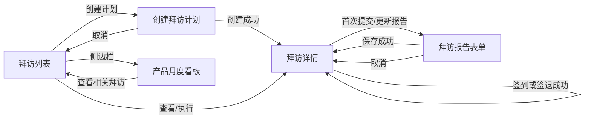

# 医药代表学术拜访管理子系统：前端信息架构

## 1. 目标与设计原则

本文基于现有 REST API 契约和业务规则，定义桌面端 MVP 的页面、交互、状态展示及 API 调用关系。
本轮只做设计，不新增前端代码或后端接口。

设计原则：

- 以“计划创建 → 现场执行 → 报告提交 → 数据复核”为主线，所有生命周期操作都从同一个工作流
  ID 进入。
- 服务端返回的 `status`、`allowedActions`、时间、距离、停留时长及合规 finding 是唯一可信事实；
  前端只负责输入、展示和格式化。
- 桌面端优先，建议可用视口宽度不低于 `1280px`；不设计移动端导航、手势或 GPS 自动采集。
- 使用 Ant Design 的表格、表单、抽屉/弹窗、结果页和反馈组件；ECharts 只用于有信息价值的统计图。
- 不使用全局复杂状态管理。筛选条件存入 URL，页面数据和表单状态留在对应页面组件内。
- 不做乐观状态流转。写请求成功后使用服务端响应更新页面；出现 `409` 时重新获取详情。
- 页面使用清晰的留白、分隔线和少量状态色，不使用装饰性渐变、多层嵌套卡片或无意义动画。

## 2. 当前 API 前置条件与配置

### 2.1 主数据选项

创建计划页面通过 `GET /api/reference-data/visit-planning` 获取启用的 MR、产品和有效的
医院—科室—医生执业关系。前端从执业关系派生联动选项，不硬编码 seed UUID，也不从分页拜访列表
拼凑主数据。创建请求仍只提交业务契约规定的 ID，不提交内部 `hcpPracticeId`。

### 2.2 业务时区

月度看板响应包含 `businessTimezone`，但拜访接口没有返回全站时区配置。当前可由前端构建配置
`VITE_BUSINESS_TIMEZONE` 提供显示时区，默认 `Asia/Shanghai`，并要求部署配置与后端一致；看板页
以响应值为准。如果看板响应与前端配置不同，应显示非阻塞告警并记录配置问题。

时间解析必须保留响应所代表的绝对时间点，再转换到业务时区显示；不能截取 ISO 字符串或按浏览器
本地时区直接解释。请求中的计划时间应携带明确 offset。

## 3. 路由与导航

| 路由 | 页面 | 导航入口 | 说明 |
| --- | --- | --- | --- |
| `/` | 重定向 | 无 | 重定向到 `/visits` |
| `/visits` | 拜访列表 | 侧边栏“拜访管理” | 生命周期工作台，包含计划和实际拜访 |
| `/visit-plans/new` | 创建拜访计划 | 侧边栏/列表主按钮 | 创建计划，不创建无计划拜访 |
| `/visits/:workflowId` | 拜访详情 | 列表行、创建成功 | 展示计划、执行事实、合规结论和报告 |
| `/visits/:workflowId/report` | 拜访报告表单 | 详情页状态操作 | 首次提交和整体更新共用页面 |
| `/dashboard/products` | 产品月度看板 | 侧边栏“产品看板” | 按产品展示月度拜访统计 |
| `/system/health` | 系统状态 | 次级入口 | 避免与后端 `GET /health` 冲突；保留脚手架已有健康页，不属于核心业务导航 |
| `*` | 404 页面 | 无 | 提供“返回拜访列表”按钮，不静默跳转 |

签到和签退使用详情页内的 Modal，不设置独立路由。两种操作字段少、必须结合当前详情判断状态，弹窗
能避免产生可收藏但已过期的操作 URL。报告字段较多且需要动态列表，因此使用独立页面。

### 3.1 页面跳转关系



看板到列表的跳转仅携带当前 API 能表达的筛选，例如 `productId` 和业务月对应的 `checkInFrom`、
`checkInTo`；不能把图表中的聚合数当作列表数据直接展开。

## 4. 基础桌面布局

```text
┌────────────────┬──────────────────────────────────────────────────────┐
│ 品牌/系统名称   │ 页面标题 / 面包屑                         辅助信息  │
├────────────────┼──────────────────────────────────────────────────────┤
│ 拜访管理        │                                                      │
│ 创建拜访计划    │  页面操作栏：标题、说明、主操作                      │
│ 产品月度看板    │  ────────────────────────────────────────────────    │
│                │  筛选区 / 页面内容 / 表格或图表                      │
│                │                                                      │
│                │  分页或底部操作                                      │
└────────────────┴──────────────────────────────────────────────────────┘
```

- 左侧固定侧边栏建议宽 `216–232px`，只放三个核心入口；“创建拜访计划”也可作为拜访列表的主按钮。
- 顶部栏建议高 `56–64px`，显示页面面包屑、业务时区和系统状态入口；MVP 不显示用户头像或权限菜单。
- 内容区使用浅灰页面背景与单层白色内容面，页边距 `24–32px`。表格页允许占满可用宽度。
- 页面标题、说明和主操作在同一层级。避免“页面 Card 内再嵌套多个 Card”；详情分区使用标题、
  `Descriptions`、`Timeline`、`Table` 和 `Divider`。
- 生命周期状态使用固定色彩语义；异常状态额外使用红/橙色，但不能只靠颜色表达。

## 5. 页面设计

### 5.1 拜访列表 `/visits`

#### 页面职责

- 作为全部拜访工作流的统一入口，同时展示 `PLANNED`、`CHECKED_IN`、`CHECKED_OUT`、`REPORTED`。
- 提供分页、筛选和排序；不能把列表条数当成月度统计。
- 帮助用户识别下一步动作，但执行写操作前必须进入或重新获取详情。

#### 筛选区

第一行保持高频字段，第二行通过“更多筛选”展开：

| 字段 | 控件 | URL 参数/API 参数 | 规则 |
| --- | --- | --- | --- |
| 状态 | 多选 Select | 重复 `status` | 四种生命周期状态 |
| 计划日期 | DatePicker.RangePicker | `plannedFrom`、`plannedTo` | 业务时区自然时间，发送带 offset 的半开区间 |
| 合规情况 | Select | `isAbnormal` | 全部/已有异常/当前无已发现异常 |
| MR | Select | `mrId` | 选项来自创建计划主数据接口 |
| HCP | Select | `hcpId` | 按医院和科室过滤有效执业关系 |
| 医院 | Select | `hospitalId` | 选项来自有效执业关系 |
| 科室 | Select | `departmentId` | 按医院过滤 |
| 产品 | Select | `productId` | 选项来自启用产品 |
| 签到日期 | DatePicker.RangePicker | `checkInFrom`、`checkInTo` | 使用后自动排除未签到计划 |

“查询”把条件和 `page=1` 写入 URL；刷新页面可恢复筛选。“重置”清空筛选和排序。服务端仍是筛选
参数和主数据有效性的最终校验者。

#### 表格列

| 列 | 数据来源/展示 | 备注 |
| --- | --- | --- |
| 计划时间 | `plannedAt` | 按业务时区显示，支持服务端排序 |
| 状态 | `status` | 中文标签 + 原始状态 tooltip |
| 医生 | `hcpPractice.hcp` | 主行名称，次行代码 |
| 医院/科室 | `hcpPractice.hospital`、`department` | 两行紧凑展示 |
| MR | `mr` | 名称 + 代码 |
| 目标产品 | `targetProducts` | 最多显示 2 个 Tag，其余 `+N` |
| 执行时间 | `executionSummary` | 签到/签退时间；未签到显示“尚未签到” |
| 停留时长 | `durationSeconds` | 仅格式化为 `x 分 y 秒`；不自行计算 |
| 合规 | `isAbnormal`、`findingCodes` | 异常/当前无已发现异常；未签退时注明“评估未完成” |
| 报告 | `reportSubmittedAt` | 已提交时间或“未提交” |
| 操作 | 工作流 ID、状态 | “查看详情”及一个下一步快捷入口 |

快捷入口根据摘要状态显示“签到”“签退”“填写报告”或“查看/更新报告”，点击后先请求详情。详情
返回的 `allowedActions` 若与列表状态不一致，以详情为准并提示“状态已更新”。

分页使用 `page`、`pageSize` 和服务端 `total`。改变页大小回到第 1 页；不做无限滚动。

### 5.2 创建拜访计划 `/visit-plans/new`

#### 页面职责

创建一个 `PLANNED` 工作流。页面明确说明“创建计划不会自动签到”。表单使用单列或两列栅格，
底部提供固定的“取消”和“创建计划”。

#### 表单字段

| 字段 | 控件 | 必填 | 前端校验/说明 |
| --- | --- | ---: | --- |
| 医药代表 | 可搜索 Select | 是 | 仅显示启用 MR |
| 医院 | 可搜索 Select | 是 | 来自有效执业关系 |
| 科室 | 可搜索 Select | 是 | 根据医院联动 |
| 医生 | 可搜索 Select | 是 | 根据医院和科室联动 |
| 计划时间 | DatePicker + TimePicker | 是 | 转换为带业务时区 offset 的 RFC 3339 |
| 目标产品 | 可搜索多选 Select | 是 | 至少一个；选项仅包含启用产品 |

前端请求只包含 `mrId`、`hcpId`、`hospitalId`、`departmentId`、`plannedAt`、`productIds`。不生成或
提交状态、快照、签到数据和审计时间。

创建成功后显示轻量成功消息，并 `replace` 导航到 `/visits/{id}`，避免浏览器后退后重复提交。
创建失败保留所有输入；`details[].field` 能映射时显示字段错误，否则显示表单顶部错误摘要。

### 5.3 拜访详情 `/visits/:workflowId`

#### 页面职责与区域

1. 顶部：工作流 ID、生命周期状态、合规状态、计划时间和当前主操作。
2. 计划信息：MR、HCP、医院、科室、目标产品、创建时间。
3. 执行时间线：计划、签到、签退、报告四个节点；未完成节点显示待办，不推测时间。
4. 现场事实：签到/签退坐标、服务端时间、服务端距离、服务端停留时长。
5. 合规结果：合规状态和 finding 表格；异常不会禁用后续合法动作。
6. 拜访报告：已提交时只读展示谈话要点、反馈、实际产品内容、资料派发和备注。

合规 finding 表格列为“异常类型、阶段、实际值、阈值、单位、发现时间”。代码映射为中文标题，
同时保留服务端 message；实际值不能在前端重新计算。

报告未提交时：`CHECKED_OUT` 显示操作引导；更早状态显示“完成签退后可提交报告”。已报告时显示
“更新报告”，并提示该操作是整体替换。

#### 详情主按钮

前端使用详情响应的 `allowedActions` 控制主按钮，不从 `actualVisit` 猜测：

| `allowedActions` | 主按钮 | 行为 |
| --- | --- | --- |
| `CHECK_IN` | 签到 | 打开签到 Modal |
| `CHECK_OUT` | 签退 | 打开签退 Modal |
| `SUBMIT_REPORT` | 填写拜访报告 | 跳转报告页，空表单 |
| `UPDATE_REPORT` | 更新拜访报告 | 跳转报告页，以当前完整报告初始化 |

响应数组按当前契约只有一项，但 UI 应按动作值判断，不依赖数组位置。写操作进行中禁用全部状态按钮。

### 5.4 签到和签退 Modal

签到、签退共用坐标表单组件，但标题、确认文案和 API 不同。

| 字段 | 控件 | 规则 |
| --- | --- | --- |
| 纬度 | InputNumber | 必填，有限数，`-90..90`，允许 6 位或更多小数输入 |
| 经度 | InputNumber | 必填，有限数，`-180..180`，允许 6 位或更多小数输入 |

- 页面明确标注“GPS 为演示手工输入；时间、距离、时长和合规结论由服务端生成”。
- 签退确认区提示：签退后无法修改签到/签退事实，下一步是提交拜访报告。
- 请求体只能包含 `latitude` 和 `longitude`。
- 点击确认后按钮进入 loading，禁用取消和重复提交；不自动重试 POST。
- 成功后关闭 Modal，以返回的完整详情替换当前详情并显示成功消息。
- `409` 表示页面状态过期：关闭或保留弹窗均可，但必须重新获取详情并展示稳定错误含义。
- `422 INVALID_COORDINATES` 映射到对应字段；其他错误显示在弹窗顶部。

### 5.5 拜访报告 `/visits/:workflowId/report`

#### 页面职责

首次提交与更新使用同一完整表单。进入页面先获取详情：只有 `SUBMIT_REPORT` 或 `UPDATE_REPORT`
存在时可编辑；否则显示状态错误并提供返回详情按钮。更新模式必须用服务端当前完整报告初始化，不能
只提交用户修改过的局部字段。

#### 表单字段

| 字段 | 控件 | 规则 |
| --- | --- | --- |
| 谈话要点 `conversationSummary` | TextArea | 必填，去空白后非空 |
| 医生反馈 `hcpFeedback` | TextArea | 必填，去空白后非空 |
| 可选备注 `notes` | TextArea | 可空；空白提交为 `null` |
| 实际沟通产品 `detailingRecords` | 动态表单行 | 至少一行，同一产品不可重复 |
| 沟通产品 | Select | 选项严格来自 `plan.targetProducts` |
| 学术内容说明 `contentSummary` | TextArea | 每个产品必填、非空 |
| 资料派发 `materialDistributions` | 可增删表格 | 数组可为空 |
| 资料关联产品 | Select + “通用资料” | 可空；非空时来自目标产品 |
| 资料编码 `materialCode` | Input | 必填，最多 100 字符 |
| 资料名称 `materialName` | Input | 必填，最多 200 字符 |
| 数量 `quantity` | InputNumber | 必填，非负整数，`0` 合法 |
| 合规资料 `isCompliant` | Switch/Radio | 必填，明确显示“合规/不合规”，不只显示开关颜色 |

资料行使用可编辑 Table 或扁平动态列表，不为每一行嵌套 Card。删除行需要轻量确认；报告整体更新
页面顶部提示“保存会整体替换现有沟通记录和资料派发明细”。

成功后显示“拜访报告已提交”或“拜访报告已更新”，并 `replace` 返回详情页。失败保留表单内容；
服务端 `REPORT_PRODUCT_NOT_IN_PLAN` 等错误优先定位到对应动态行，不能清空原报告。

### 5.6 产品月度看板 `/dashboard/products`

#### 页面职责

按服务端业务时区和签到月份展示产品访问量，不能下载拜访列表后在浏览器聚合。

顶部筛选：

- 月份 MonthPicker，默认业务时区下的当前月份，提交格式严格为 `YYYY-MM`。
- 产品筛选可选，可使用主数据接口的产品选项；选中后使用 `productId` 重新请求后端，而不是只做
  前端聚合。

主体采用“一图一表”：

- ECharts 分组/堆叠柱状图：每个产品展示正常、异常、待评估；总次数可用标签或 tooltip 展示。
- 明细表列：产品名称/代码、总次数、正常次数、异常次数、待评估次数、异常率。
- 异常率仅作为展示派生值 `abnormalCount / totalCount`，标注为展示指标；它不是可信业务事实，也不
  回传服务端。`totalCount = 0` 时显示 `—`。
- 图表和表格顺序沿用服务端的“总次数降序、名称升序”，前端不重新改变业务排序。
- 页头展示 `businessTimezone` 以及该月对应的 UTC 查询边界，边界放在 tooltip/说明中，不喧宾夺主。

点击产品行“查看拜访”跳转 `/visits`，携带 `productId` 以及响应 `rangeStartUtc`、`rangeEndUtc`
作为签到时间范围。异常、正常、待评估分类没有一一对应的完整列表过滤能力：当前 API 只有
`isAbnormal=true/false`，因此不提供会产生错误语义的分类下钻。

## 6. 状态、合规与按钮映射

### 6.1 生命周期映射

| 状态 | 中文 | 状态样式 | 允许动作 | 页面主按钮 |
| --- | --- | --- | --- | --- |
| `PLANNED` | 待签到 | 蓝/中性 | `CHECK_IN` | 签到 |
| `CHECKED_IN` | 拜访进行中 | 蓝 | `CHECK_OUT` | 签退 |
| `CHECKED_OUT` | 待提交报告 | 金/橙 | `SUBMIT_REPORT` | 填写拜访报告 |
| `REPORTED` | 已完成 | 绿 | `UPDATE_REPORT` | 更新拜访报告 |

列表可按状态映射快捷入口；详情必须使用服务端 `allowedActions`。合规异常不改变生命周期按钮。

### 6.2 合规状态映射

| 合规状态 | 展示 | 说明 |
| --- | --- | --- |
| `IN_PROGRESS` | 评估未完成 | 已签到未签退且当前无 finding |
| `NORMAL` | 正常 | 已签退且没有 finding |
| `ABNORMAL` | 异常 | 至少一个 finding；可能在签到超距时已确定 |

`CHECKED_IN + ABNORMAL` 需要同时显示“已发现异常”和“最终评估未完成”，避免把已知异常误写成最终
finding 集已经完整。

## 7. 通用交互状态

### 7.1 加载态

- 首次列表和看板加载：保留页面标题与筛选区，内容区使用 Table loading/Skeleton，避免整页闪烁。
- 翻页、排序、重新筛选：保留旧数据并给表格加 loading 遮罩；请求完成前禁用重复分页操作。
- 详情首次加载：使用与最终分区相近的 Skeleton；不能短暂显示错误状态按钮。
- 表单提交：主按钮显示 loading，禁用表单和离开确认；禁止重复 POST/PUT。
- 只读 GET 可以提供“重试”；写请求不能因超时自动重试，因为创建计划、签到和签退不是幂等成功。

### 7.2 空状态

| 场景 | 空状态文案 | 操作 |
| --- | --- | --- |
| 系统无拜访 | 暂无拜访计划 | 创建拜访计划 |
| 筛选无结果 | 没有符合当前条件的拜访 | 清空筛选 |
| 未签到 | 尚未产生实际拜访 | 状态允许时签到 |
| 无 finding | 暂无合规异常 | 无主操作；未签退时注明评估未完成 |
| 未提交报告 | 尚未提交拜访报告 | 状态允许时填写报告 |
| 看板无数据 | 该月份暂无已签到拜访 | 切换月份/前往拜访列表 |
| 资料派发为空 | 本次未记录资料派发 | 编辑报告时添加资料 |

### 7.3 错误态

统一解析 `{ error: { code, message, details } }`：

| 类型 | 页面处理 |
| --- | --- |
| 网络不可达/超时 | 页面或局部 Alert，提供手动重试；写请求提示先核对详情，不能自动重发 |
| `404` 详情不存在 | Result 404 + 返回列表 |
| `404` 引用不存在 | 保留表单，定位字段并提示主数据可能已变化 |
| `409` 状态冲突 | 显示稳定错误文案，重新请求详情，以服务端状态刷新按钮 |
| `422` 字段错误 | 根据 `details[].field` 映射 Form.Item；无法映射的错误放顶部摘要 |
| `500 INTERNAL_SERVER_ERROR` | 通用失败提示，不显示响应体之外的内部信息；提供请求 ID（如有） |

建议为稳定错误码维护集中式中文文案映射，服务端 `message` 作为兜底。前端不得通过英文 message
字符串判断分支。

### 7.4 成功反馈

- 只读请求成功不弹 toast。
- 创建计划：`message.success("拜访计划已创建")`，跳转详情。
- 签到：`message.success("签到成功")`，刷新详情和状态按钮；若已产生签到超距 finding，同时显示
  持续可见的异常 Alert。
- 签退：`message.success("签退成功")`，展示服务端停留时长和全部 finding。
- 首次报告：提示“拜访报告已提交”；更新报告：提示“拜访报告已更新”。
- 成功提示简短，不用彩纸动画或全屏成功页阻断演示流程。

## 8. 前端数据与状态策略

- 使用现有 Axios client；按 `visitPlansApi`、`visitsApi`、`dashboardApi` 分模块封装。
- 每个页面使用本地 hook 管理 `data/loading/error`，表单使用 Ant Design Form。
- 列表筛选、排序和分页以 `URLSearchParams` 为状态来源，便于刷新、返回和 Demo 分享。
- 不新增 Redux、Zustand 等全局 store。跨页面只传 `workflowId` 和 URL 查询参数，目标页重新请求可信数据。
- 写请求不做乐观更新；使用服务端返回的完整工作流详情覆盖本地详情。
- 可用 `AbortController` 取消筛选快速变化产生的旧 GET，避免后返回的旧响应覆盖新条件。
- 不持久化报告草稿到服务端。若用户编辑后离开，使用路由离开确认；是否增加本地草稿不属于本次 MVP。

## 9. API 调用映射

| 页面/动作 | HTTP API | 请求来源 | 成功后的前端动作 |
| --- | --- | --- | --- |
| 拜访列表加载 | `GET /api/visits` | URL 筛选、分页、排序 | 渲染摘要表格 |
| 列表快捷动作预检 | `GET /api/visits/{id}` | 行 ID | 根据 `allowedActions` 打开操作或进入详情 |
| 创建页选项加载 | `GET /api/reference-data/visit-planning` | 无 | 构造 MR、医院、科室、医生和产品选项 |
| 创建计划 | `POST /api/visit-plans` | 创建表单六个允许字段 | 跳转 `/visits/{id}` |
| 详情加载 | `GET /api/visits/{id}` | 路由参数 | 渲染完整工作流 |
| 签到 | `POST /api/visits/{id}/check-in` | 手工纬度、经度 | 用响应替换详情 |
| 签退 | `POST /api/visits/{id}/check-out` | 手工纬度、经度 | 用响应替换详情 |
| 报告页初始化 | `GET /api/visits/{id}` | 路由参数 | 校验动作并初始化完整报告 |
| 首次提交/整体更新报告 | `PUT /api/visits/{id}/report` | 完整报告表单 | 返回详情页 |
| 月度看板 | `GET /api/dashboard/monthly-visits-by-product` | `month`、可选 `productId` | 渲染图表和表格 |
| 看板下钻 | `GET /api/visits` | 产品 ID、签到 UTC 范围 | 在拜访列表展示对应工作流 |

`GET /api/visit-plans` 当前不需要单独页面：`GET /api/visits` 已包含 `PLANNED` 并提供执行摘要，适合
作为统一工作台。保留该接口供未来“纯计划管理”页面使用，MVP 不重复建设两个相似列表。

## 10. 演示主路径

推荐 Demo 按以下顺序，能覆盖完整状态机与看板：

1. 从拜访列表进入创建页，创建一个包含多个产品的计划。
2. 自动进入详情，展示 `PLANNED` 和唯一可用的“签到”操作。
3. 手工输入坐标签到，展示服务端签到时间、距离及可能的签到异常。
4. 手工输入坐标签退，展示服务端停留时长和完整合规 finding。
5. 进入报告表单，填写多个产品的沟通内容及资料派发，提交后展示 `REPORTED`。
6. 更新一次完整报告，证明签到、签退和 finding 未被修改。
7. 进入产品月度看板，展示多产品分别计数以及正常、异常、待评估拆分。

创建页通过只读主数据接口获得联动选项，不硬编码数据库 ID；创建成功后只使用服务端返回的工作流
ID 跳转详情。
